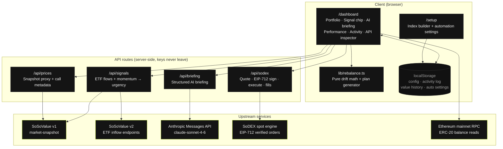
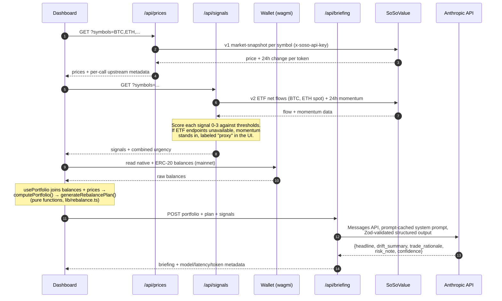
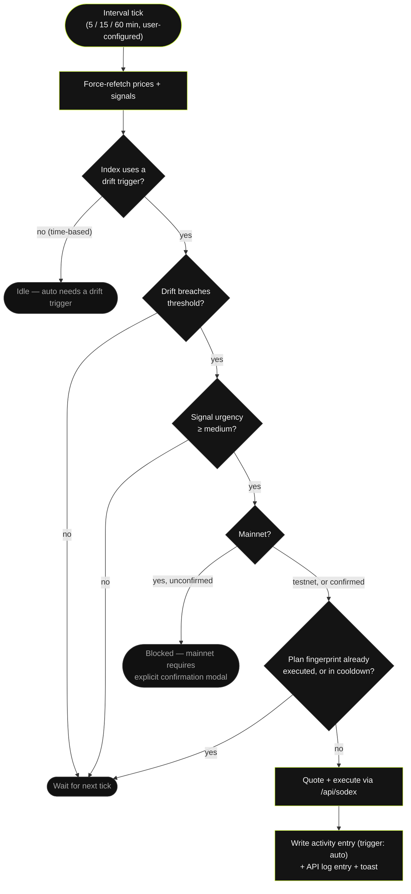
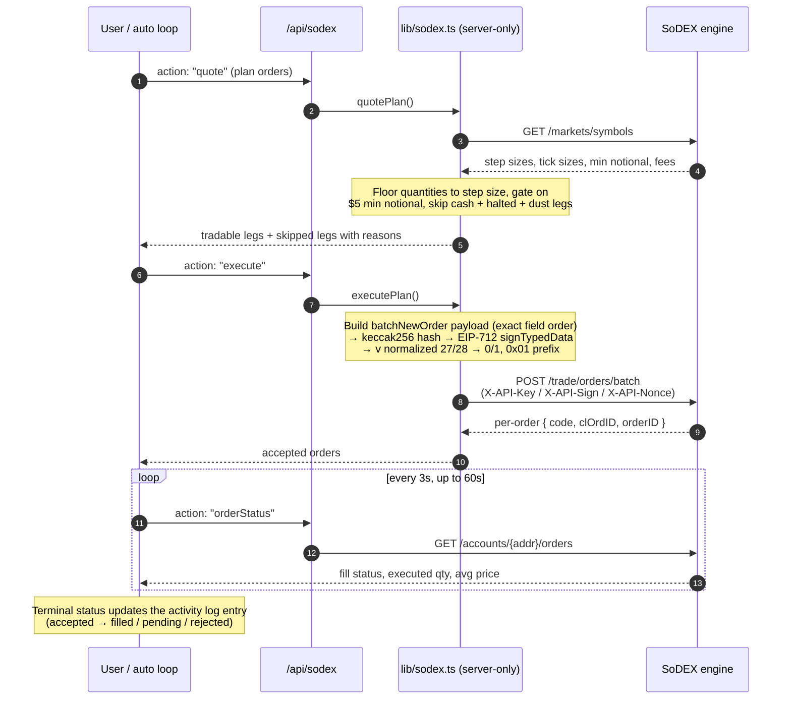

# IndexPilot

A personal on-chain index fund with drift detection, SoSoValue-driven timing signals, AI-explained rebalancing, and autonomous execution on SoDEX spot markets.

## Contents

- [Overview](#overview)
- [Features](#features)
- [System architecture](#system-architecture)
- [Data flow](#data-flow)
- [Auto-rebalance decision loop](#auto-rebalance-decision-loop)
- [Execution pipeline](#execution-pipeline)
- [Project structure](#project-structure)
- [Stack](#stack)
- [Getting started](#getting-started)
- [Environment variables](#environment-variables)
- [Scripts](#scripts)
- [Release status](#release-status)
- [Observability](#observability)
- [Security posture](#security-posture)
- [License](#license)

## Overview

Manual portfolio rebalancing is tedious and error-prone. You set target weights, prices move, weights drift, and you either forget to rebalance or rebalance reactively without a clear thesis. Most retail tooling hides the math behind a black box or dumps raw numbers without context.

IndexPilot keeps the math transparent and the explanation specific:

- **Deterministic plans.** Every rebalance plan is a pure function of live prices, target weights, and a drift threshold. No hidden heuristics.
- **Explained trades.** Every plan is paired with a structured AI briefing that cites the exact drift figures, 24-hour price moves, and institutional ETF flows behind each trade.
- **A closed loop.** With auto mode enabled, drift past threshold plus a live market signal triggers real execution on SoDEX — quoted, signed, submitted, and fill-confirmed without a click.

## Features

| Capability | Description |
| --- | --- |
| Index builder | Curated token list with live 100% allocation validation and even-split helper |
| Live market data | SoSoValue Open API prices on a 5-minute cadence, proxied server-side |
| Market signal layer | Urgency score (low / medium / high / urgent) derived from spot ETF net flows and 24h momentum |
| Drift detection | Per-asset current weight, target weight, drift percentage, and status |
| Rebalance planning | Deterministic ordered buy/sell list with token amount, USD amount, and execution price |
| AI briefing | Structured output (headline, drift summary, trade rationale, risk note, confidence) tying signals to the plan |
| SoDEX execution | Quote, server-side EIP-712 signing, batch order submission, fill-confirmation polling |
| Auto-rebalance | Opt-in loop gated on drift trigger, signal urgency, and an explicit mainnet confirmation |
| Performance tracking | Index value vs perfectly-balanced counterfactual, 7 days at 5-minute resolution |
| Activity log | Persistent record of every execution: orders, notional, fill status, briefing headline |
| API inspector | Dashboard tray surfacing every upstream call with status, latency, and token usage |

## System architecture

Client pages talk only to the app's own API routes; every external key stays server-side. Deterministic math (`lib/rebalance.ts`) runs client-side on data the API routes return.



## Data flow

One dashboard render, end to end. Prices and signals refresh on a 5-minute cadence; the briefing re-fires only when the plan's order signature materially changes.



Alongside this, `useValueHistory` records a `{ timestamp, actualUsd, targetUsd, network }` snapshot at most every 5 minutes (7-day retention) and feeds the performance chart: actual index value versus the perfectly-balanced counterfactual.

## Auto-rebalance decision loop

Auto mode never fires on a single condition. Every gate below must pass on the same tick, and two refire protections apply on top: one execution per plan fingerprint, plus a full-interval cooldown.



Disabling auto mode revokes the mainnet clearance; re-enabling requires confirming again.

## Execution pipeline

SoDEX authentication is Hyperliquid-style: an API key name in the header plus private-key EIP-712 signing, which a browser wallet cannot perform. Signing therefore happens server-side with a dedicated API wallet. The full pipeline was validated on mainnet with a real fill.



Market orders use `funds` (USDC) on buys and `quantity` (base asset) on sells, with IOC time-in-force.

## Project structure

```
app/
  api/
    briefing/route.ts        AI briefing endpoint (Anthropic Messages API, structured Zod output)
    prices/route.ts          SoSoValue price proxy with per-call metadata
    signals/route.ts         SoSoValue signal layer (ETF flows + momentum -> urgency)
    sodex/route.ts           SoDEX quote / execute / balances / order-status actions
  dashboard/page.tsx         Main app surface
  docs/                      Public docs site (six pages)
  setup/page.tsx             Index builder + automation settings
  layout.tsx, providers.tsx  Fonts, metadata, query client, wallet providers
components/
  dashboard/
    AIBriefing.tsx           Structured briefing display (headline, drift, rationale, risk)
    ActivityLog.tsx          Persistent executed-rebalance history
    ApiCallLog.tsx           Live SoSoValue + signals + briefing + SoDEX call inspector
    MarketSignalChip.tsx     Urgency chip with per-signal tooltip
    PerformanceChart.tsx     Index value vs target counterfactual (recharts)
    PortfolioChart.tsx       Current vs target allocation donuts
    RebalancePanel.tsx       Orders, quote/execute flow, fill confirmation
    TokenTable.tsx, DriftBar.tsx, PriceSourceTag.tsx
  setup/                     AllocationRow, TokenPicker, TriggerSelector, AutoRebalanceToggle
  ui/                        Button, Card, Badge, Input, Toaster primitives
  Header.tsx, NetworkSwitcher.tsx, WalletButton.tsx
hooks/
  useAutoRebalance.ts        Autonomous drift-check + execute loop with safety gates
  useBriefing.ts             React Query hook for /api/briefing
  useOrderFills.ts           3s/60s fill-status polling after execution
  usePortfolio.ts            Config + prices + balances -> PortfolioState
  usePrices.ts, useSignals.ts, useRebalance.ts, useSodex.ts,
  useSodexBalances.ts, useWalletBalances.ts, useValueHistory.ts
lib/
  activityLog.ts             Persistent rebalance log (localStorage, capped at 50)
  apiCallLog.ts              In-memory pub/sub ring buffer of recent API calls
  autoRebalance.ts           Auto-mode settings (enabled, cadence, mainnet clearance)
  rebalance.ts               Pure drift math + plan generator
  signalTypes.ts             Client-safe signal types + urgency ranking
  sodex.ts                   Server-only SoDEX client (markets, EIP-712 signing, fills)
  sodexTypes.ts              Client-safe SoDEX types
  sosovalue.ts               Client-side price fetcher
  sosovalue-signals.ts       Server-only signal fetch + urgency scoring
  storage.ts                 Versioned typed localStorage wrapper (index config)
  toast.ts                   Toast pub/sub (auto-execution notifications)
  tokens.ts                  Token registry with SoSoValue currency IDs
  valueHistory.ts            7-day value snapshots + target counterfactual
  types.ts, utils.ts, chains.ts, wagmi.ts
```

## Stack

| Layer | Choice |
| --- | --- |
| Framework | Next.js 16 (app router) + React 19 |
| Language | TypeScript strict |
| Styling | Tailwind CSS v4 |
| UI primitives | Hand-rolled (Button, Card, Badge, Input, Toaster) |
| State (server) | TanStack Query 5 (5-minute price stale time) |
| State (client) | useState + localStorage (versioned schema) |
| Wallet | wagmi v2 + viem v2 + RainbowKit 2 |
| Charts | Recharts 3 |
| Market data | SoSoValue Open API (v1 snapshots, v2 ETF flows) |
| AI briefing | Anthropic Messages API (`claude-sonnet-4-6`) with Zod-validated structured outputs and prompt caching |
| Execution | SoDEX spot (server-side EIP-712 signing, validated on mainnet with a real fill) |

## Getting started

```bash
npm install
cp .env.example .env.local
# fill in SOSOVALUE_API_KEY and ANTHROPIC_API_KEY at minimum
npm run dev
```

Open `http://localhost:3000`. Without SoDEX credentials the app runs fully in read-and-plan mode; the execution endpoints return a clear 503 with instructions.

## Environment variables

| Variable | Purpose | Required |
| --- | --- | --- |
| `SOSOVALUE_API_KEY` | Server-side key for SoSoValue market data. Read in `/api/prices` and `/api/signals`. | Yes |
| `ANTHROPIC_API_KEY` | Server-side key for the Anthropic Messages API. Read in `/api/briefing` only. | Yes |
| `SODEX_SIGNER_PRIVATE_KEY` | Private key of the SoDEX API wallet; signs trading actions server-side. | For execution |
| `SODEX_API_KEY_NAME` | Registered SoDEX API key name (X-API-Key header). | For execution |
| `SODEX_ACCOUNT_ID` | Optional numeric account id override. | Optional |
| `SODEX_ACCOUNT_ADDRESS` | Optional account address (defaults to the signer's). | Optional |
| `SODEX_NETWORK` | `mainnet` (default) or `testnet`. Mainnet places real orders. | Recommended |
| `NEXT_PUBLIC_WALLETCONNECT_PROJECT_ID` | WalletConnect v2 project ID for RainbowKit. | Recommended |

All API keys and the signing key are read server-side. Nothing prefixed with `NEXT_PUBLIC_` carries a secret.

## Scripts

```bash
npm run dev        # start dev server
npm run build      # production build
npm run start      # serve production build
npm run lint       # eslint
npm run typecheck  # tsc --noEmit
```

## Release status

| Capability | Wave 1 | Wave 2 | Wave 3 |
| --- | --- | --- | --- |
| Index builder UI | shipped | shipped | + automation settings |
| Live prices (SoSoValue) | shipped | + per-call metadata | shipped |
| Market signal layer (ETF flows, momentum, urgency) | — | — | **shipped** |
| Drift math and plan generator | shipped | shipped | shipped |
| Plan explanation | templated string | AI briefing (structured output) | + signal-aware timing context |
| SoDEX execution | typed empty slot | **shipped** (EIP-712, validated with a real mainnet fill) | + fill confirmation polling |
| Auto-triggered rebalancing | — | — | **shipped** (drift + urgency gated, mainnet confirm) |
| Activity log | in-memory only | in-memory only | **persistent** (localStorage, fill status, 50 entries) |
| Performance chart (actual vs target) | — | — | **shipped** (7 days, 5-min snapshots) |
| On-chain balance reads | simulated | **shipped** (mainnet ERC-20 + SoDEX testnet account) | shipped |
| Dashboard API inspector | — | shipped | + signals and auto-execution entries |
| Documentation site | shipped | shipped | shipped |

## Observability

The dashboard exposes everything the agent does:

- **Market Signal chip** — current urgency with a tooltip listing each contributing signal and its source (real ETF flow vs labeled momentum proxy).
- **Live API calls tray** — every `/api/prices`, `/api/signals`, `/api/briefing`, and `/api/sodex` request with status, latency, and (for the briefing) token usage. Auto-executions appear here and in the activity log tagged `auto`.
- **Server logs** — the same data mirrored to stdout under `[prices]`, `[signals]`, `[briefing]`, and `[sodex]` prefixes, including token usage and prompt-cache hit metrics per briefing call.

## Security posture

- No secrets in client code, `.env.example`, or git history.
- `.npmrc` enforces a 7-day minimum release age on every install (`min-release-age=7`).
- Pinned dependency versions (`save-exact=true`).
- All API keys and the SoDEX signing key are read server-side only and never appear in network responses.
- All API route inputs are schema-validated (Zod) before reaching upstream services.
- Auto-execution on mainnet is double-gated: an explicit confirmation modal at enable time, re-checked at fire time; disabling auto mode revokes the clearance.
- Anthropic SDK calls use typed exception classes (`AuthenticationError`, `RateLimitError`, `APIError`) instead of string matching on error messages.

## License

Proprietary. All rights reserved.
